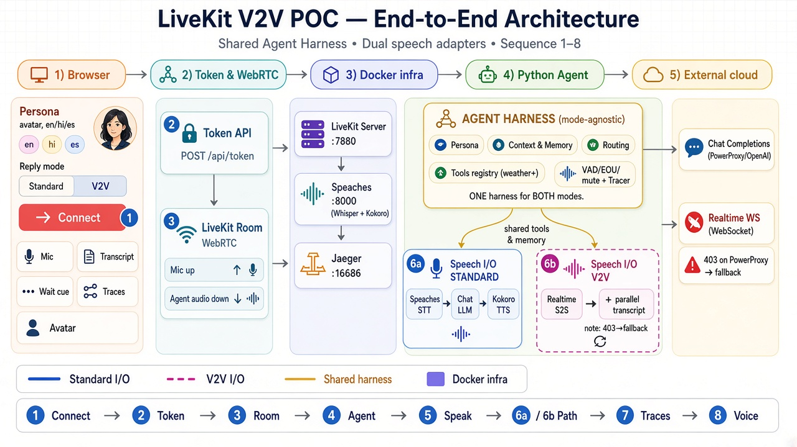
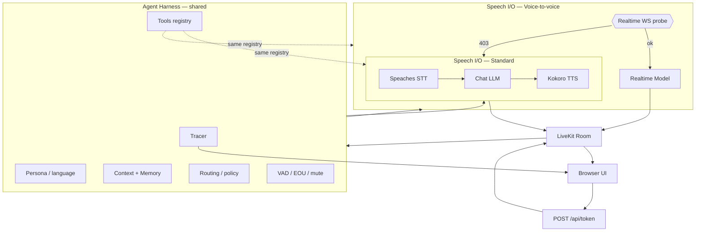

# LiveKit V2V POC — End-to-End Architecture



> **Share this:** `docs/livekit-v2v-poc-architecture.png` (presentation / LinkedIn).  
> Structural notes below match the diagram (sequence **1–8**, shared harness, dual speech adapters).

> **Design stance:** Reply mode (Standard vs Voice-to-voice) chooses a **speech I/O adapter** only.  
> **Tools, memory, context, and routing** belong in a shared **Agent Harness** that both modes use.  
> Today’s code still leans tools toward Standard (weather is reliable there; V2V is best-effort) — that is a **gap to close**, not the target shape.

## Sequence (①–⑧) — do not skip ①

| # | Step | What happens |
|---|------|----------------|
| **①** | Connect + persona | Tester opens UI (`localhost:3000`), picks avatar / language / reply mode, clicks Connect |
| **②** | Token + metadata | `POST /api/token` returns LiveKit JWT; job metadata carries `avatar_gender`, `session_language`, `reply_mode` |
| **③** | Join LiveKit room | Browser publishes mic; WebRTC to LiveKit (`:7880`) |
| **④** | Agent joins + greeting | Worker joins room → harness applies persona → greeting via active speech adapter |
| **⑤** | User speaks | Silero VAD / EOU (and mute gate) on shared harness path |
| **⑥** | Speech path | **Standard:** Speaches STT → chat LLM → Kokoro TTS · **V2V:** Realtime S2S (+ parallel transcript); 403 → fallback to Standard |
| **⑦** | Transcript + traces | UI transcript + session traces (JSONL / topic / Jaeger) — not on spoken critical path |
| **⑧** | Agent voice plays | Agent audio down the LiveKit room into the browser |

## Target shape: shared harness + dual speech adapters

```text
                    ┌─────────────────────────────────────────────┐
                    │         AGENT HARNESS (mode-agnostic)         │
                    │  • Persona / language policy                  │
                    │  • Context + Memory (multiturn / session)     │
                    │  • Routing / policy layer                     │
                    │  • Tools registry (weather → more tools)      │
                    │  • VAD / EOU / mute gate                      │
                    │  • Session tracer                             │
                    └───────────────┬─────────────┬─────────────────┘
                                    │             │
                    ┌───────────────▼─────┐ ┌─────▼──────────────────┐
                    │ Speech I/O: STANDARD │ │ Speech I/O: V2V         │
                    │ STT → Chat LLM → TTS │ │ Realtime Model (+ text) │
                    └─────────────────────┘ └────────────────────────┘
                                    │             │
                                    └──────┬──────┘
                                           ▼
                                    LiveKit Room ↔ Browser
```

| Layer | Owns | Does **not** own |
|-------|------|------------------|
| **Agent Harness** | Tools, memory, context, routing, persona, EOU, traces | Codec / STT / TTS / Realtime wire protocol |
| **Standard adapter** | Speaches Whisper + Kokoro PCM + chat completions transport | Tool definitions / long-term memory |
| **V2V adapter** | Realtime WS speech path + parallel transcript | Separate tool silo (must call same registry) |

## Components (runtime map)

| Layer | Piece | Role |
|-------|--------|------|
| Browser | Next.js UI (`:3000`) | Persona, reply mode, Connect, mic, transcript, wait cue, traces |
| Web API | `POST /api/token` | LiveKit token + job metadata |
| Transport | LiveKit Server (`:7880`) | WebRTC room |
| Speech (standard) | Speaches (`:8000`) | Whisper STT + Kokoro TTS |
| Harness | LangGraph + LiveKit `Agent` | Persona, routing, tools, memory/context, EOU, traces |
| LLM / Realtime | Azure PowerProxy / OpenAI | Chat (standard) · Realtime WS (V2V, often blocked on PowerProxy) |
| Observability | Jaeger + JSONL + UI panel | Session traces |

## Dual modes (Mermaid)



## Current code vs target (honest gap)

| Concern | Today | Target (for more tools / memory / harness) |
|---------|--------|-----------------------------------------------|
| Tools (`lookup_weather`) | On `GraphBackedAssistant`; full path in Standard; V2V best-effort / limitation message | **Tools registry inside harness**; both adapters invoke the same tools |
| Memory / multiturn | LiveKit chat ctx + LangGraph state (light) | Explicit **context + memory** module used by both modes |
| Routing | Mostly mode factory + prompts | **Routing / policy layer** (tool vs chitchat vs RAG, etc.) above speech I/O |
| V2V on PowerProxy | WS often **403** → auto-fallback to Standard | Keep fallback; Realtime needs a capable endpoint (fix later) |

## Process map (`./start_app.sh`)

```text
Docker:  LiveKit + Speaches + Jaeger
Host:    uv run agent.py  +  Next.js (bound to 127.0.0.1:3000)
```

## Next design work (when you add tools / memory / harness)

1. Extract a **mode-agnostic harness** package: `tools/`, `memory/`, `routing/`, `persona/` — no imports from Speaches- or Realtime-specific modules.  
2. Register tools once; wire them into Standard (chat tool-calls) **and** V2V (Realtime function tools) through one interface.  
3. Keep speech adapters thin: only STT/TTS/Realtime session plumbing.  
4. Keep LangGraph (or successor) as the inspectable supervisor for policy + session state.
